# 3기 제자 스쿨 교재

> 주제: **믿음구원, 행위심판**  
> 기간: 2026 상반기, 2026-06-04~06  
> 대상 학습자: 제자훈련에 참여하며 성경의 큰 흐름과 바울서신의 핵심 주제를 정리하고 싶은 성도  
> 어조: 친절하고 격려하는 강사 톤

---

## 1단원. 믿음으로 의롭게 되는 복음의 출발

### 학습 목표

- **믿음으로 의롭게 됨**이 무엇인지 갈라디아서와 로마서 본문을 통해 설명할 수 있다.
- 율법의 행위와 그리스도를 믿는 믿음의 차이를 구분할 수 있다.
- “오직 의인은 믿음으로 말미암아 살리라”는 말씀을 자신의 신앙 언어로 정리할 수 있다.

### 도입

신앙생활을 하다 보면 “내가 무엇을 얼마나 잘해야 하나님께 인정받을 수 있을까?”라는 질문을 하게 됩니다. 그러나 원본 자료는 복음의 출발점을 사람의 행위가 아니라 **예수 그리스도를 믿는 믿음**에 둡니다. 이 단원은 제자훈련의 가장 기초가 되는 믿음의 방향을 다시 확인하는 시간입니다.

### 핵심 본문

#### 믿음구원의 핵심 본문

원문은 먼저 갈라디아서 2장 16절을 제시합니다.

> “사람이 의롭게 되는 것은 율법의 행위로 말미암음이 아니요 오직 예수 그리스도를 믿음으로 말미암는 줄 알므로... 율법의 행위로써는 의롭다 함을 얻을 육체가 없느니라”

여기서 중요한 표현은 **“율법의 행위로 말미암음이 아니요”**와 **“그리스도를 믿음으로써”**입니다. 사람은 자신의 행위 자체로 의롭다 함을 얻는 것이 아니라, 그리스도를 믿음으로 의롭다 함을 얻습니다.

로마서 1장 17절도 같은 방향을 보여 줍니다.

> “복음에는 하나님의 의가 나타나서 믿음으로 믿음에 이르게 하나니... 오직 의인은 믿음으로 말미암아 살리라”

복음 안에는 **하나님의 의**가 나타납니다. 이 의는 사람이 만들어 내는 성취가 아니라, 믿음으로 받아들이고 믿음으로 살아가게 하는 하나님의 은혜입니다.

#### 믿음은 출발이자 삶의 방식

원문은 갈라디아서와 로마서를 통해 믿음을 단순한 동의가 아니라 삶의 방향으로 제시합니다. “믿음으로 믿음에 이르게” 된다는 표현은 믿음이 한 번의 선언에 머물지 않고, 계속해서 믿음으로 살아가는 여정임을 보여 줍니다.

따라서 제자의 삶은 “내가 무엇을 증명할 것인가?”보다 “내가 누구를 믿고 따를 것인가?”에서 시작합니다. 원문이 제시하는 답은 분명합니다. 제자는 **그리스도 예수**를 믿고, 그 믿음 안에서 의롭다 함을 얻습니다.

### 실전 예시 및 적용

한 성도가 자신의 부족함 때문에 “나는 아직 하나님 앞에 설 자격이 없다”고 느낀다고 생각해 봅시다. 이때 갈라디아서 2장 16절은 그 사람의 시선을 자기 행위에서 그리스도께로 옮깁니다. 제자의 첫 적용은 자신을 평가하는 기준을 바꾸는 것입니다.

- “내가 완벽해서 의롭다”가 아니라 “그리스도를 믿음으로 의롭다 함을 얻는다.”
- “내 행위가 나를 구원한다”가 아니라 “복음 안에 나타난 하나님의 의를 믿음으로 받는다.”
- “믿음은 시작만 필요하다”가 아니라 “의인은 믿음으로 살아간다.”

### 핵심 요약

믿음구원의 핵심은 사람이 율법의 행위로 의롭게 되는 것이 아니라 예수 그리스도를 믿음으로 의롭게 된다는 데 있습니다. 복음에는 하나님의 의가 나타나며, 의인은 믿음으로 살아갑니다. 제자의 삶은 자기 증명에서 출발하지 않고 그리스도를 믿는 믿음에서 출발합니다.

### 확인 문제

1. 갈라디아서 2장 16절에 따르면 사람이 의롭게 되는 근거는 무엇입니까?

   **정답:** 예수 그리스도를 믿는 믿음입니다.  
   **해설:** 원문은 “율법의 행위”가 아니라 “그리스도를 믿음으로써” 의롭다 함을 얻는다고 말합니다.

2. 로마서 1장 17절의 “오직 의인은 믿음으로 말미암아 살리라”는 말은 무엇을 강조합니까?

   **정답:** 믿음이 의롭다 함의 출발이자 삶의 방식임을 강조합니다.  
   **해설:** 원문은 복음 안에 하나님의 의가 나타나며, 그 의가 “믿음으로 믿음에 이르게” 한다고 설명합니다.

---

## 2단원. 감추인 비밀과 영화로운 교회

### 학습 목표

- 원문이 말하는 **영화로운 신부**, **비밀의 영광**, **영광의 소망**의 연결을 설명할 수 있다.
- 에베소서와 골로새서 본문을 통해 교회의 목적을 정리할 수 있다.
- 영화로운 교회가 무엇을 향해 세워지는지 이해할 수 있다.

### 도입

교회는 단지 사람들이 모이는 장소가 아닙니다. 원문은 교회를 **영화로운 신부**, **비밀의 영광**, **영광의 소망**이라는 표현으로 설명합니다. 이 단원에서는 교회가 하나님 안에 감추어졌던 비밀의 경륜과 어떻게 연결되는지 살펴봅니다.

### 핵심 본문

#### 영화로운 신부와 영광의 소망

원문은 다음과 같은 연결을 제시합니다.

> 영화로운 신부 = 비밀의 영광 = 우레소리 = 교회

또한 에베소서 5장 27절을 통해 교회의 목적을 설명합니다.

> “자기 앞에 영광스러운 교회로 세우사 티나 주름 잡힌 것이나 이런 것들이 없이 거룩하고 흠이 없게 하려 하심이라”

여기서 **영광스러운 교회**는 거룩하고 흠 없는 모습으로 세워지는 교회입니다. 원문은 이것을 “영화로운 신부”라는 표현과 연결합니다.

골로새서 1장 26~27절은 이 비밀의 내용을 더 분명하게 말합니다.

> “이 비밀은 만세와 만대로부터 감추어졌던 것인데 이제는 그의 성도들에게 나타났고... 이 비밀은 너희 안에 계신 그리스도시니 곧 영광의 소망이니라”

**영광의 소망**은 성도 안에 계신 그리스도입니다. 원문은 이 내용을 교회의 영화로움과 연결하여, 교회가 단순한 조직이 아니라 그리스도의 비밀과 영광을 드러내는 공동체임을 강조합니다.

#### 비밀의 경륜과 교회의 역할

에베소서 3장 8~11절은 원문에서 중요한 위치를 차지합니다. 바울은 “측량할 수 없는 그리스도의 풍성함”을 이방인에게 전하고, 하나님 속에 감추어졌던 **비밀의 경륜**을 드러낸다고 말합니다.

특히 원문은 에베소서 3장 10절의 흐름을 강조합니다.

> “이는 이제 교회로 말미암아 하늘에 있는 통치자들과 권세들에게 하나님의 각종 지혜를 알게 하려 하심이니”

교회는 하나님의 지혜를 드러내는 통로입니다. 원문에는 “하늘에 있는 통치자들과 권세”라는 표현이 나오며, 이것이 이후 천지 창조와 천사 계급을 다루는 내용으로 이어집니다.

#### 낮아지심과 높아지심

빌립보서 2장 6~11절은 그리스도의 낮아지심과 높아지심을 보여 줍니다.

> “오히려 자기를 비워 종의 형체를 가지사... 죽기까지 복종하셨으니 곧 십자가에 죽으심이라”

그 결과 하나님은 예수 그리스도께 “모든 이름 위에 뛰어난 이름”을 주셨고, 모든 무릎이 예수의 이름에 꿇게 하셨습니다. 원문은 이것을 영화로움과 연결합니다. 제자는 그리스도의 낮아지심과 높아지심을 통해 교회의 영광이 어떤 방향으로 드러나는지 배웁니다.

### 실전 예시 및 적용

교회 안에서 섬김을 할 때, 사람들은 자주 “내가 인정받고 있는가?”를 생각합니다. 그러나 원문이 제시하는 영화로운 교회의 길은 그리스도의 길과 연결됩니다. 그리스도는 자기를 비우고 낮아지셨으며, 하나님은 그를 높이셨습니다.

따라서 교회의 섬김은 자기 영광을 얻기 위한 행동이 아니라, **성도 안에 계신 그리스도**, 곧 **영광의 소망**을 드러내는 삶입니다.

### 핵심 요약

원문은 영화로운 신부, 비밀의 영광, 영광의 소망을 교회의 정체성과 연결합니다. 골로새서는 이 비밀이 성도 안에 계신 그리스도라고 말합니다. 에베소서는 교회를 통해 하나님의 지혜가 드러난다고 설명합니다. 영화로운 교회는 거룩하고 흠 없는 모습으로 세워지는 공동체입니다.

### 확인 문제

1. 골로새서 1장 27절에서 “영광의 소망”은 무엇으로 설명됩니까?

   **정답:** 성도 안에 계신 그리스도입니다.  
   **해설:** 원문은 “이 비밀은 너희 안에 계신 그리스도시니 곧 영광의 소망”이라는 본문을 중심으로 비밀의 영광을 설명합니다.

2. 에베소서 5장 27절이 말하는 교회의 모습은 무엇입니까?

   **정답:** 티나 주름 잡힌 것이 없이 거룩하고 흠 없는 영광스러운 교회입니다.  
   **해설:** 원문은 이 구절을 “영화로운 신부”와 연결하여 교회의 목적을 설명합니다.

---

## 3단원. 사랑으로 방문하시고 돌보시는 주님

### 학습 목표

- 원문이 말하는 “감추인 것”과 주님의 사랑을 연결해 이해할 수 있다.
- 요한복음 21장 17절의 “내 양을 먹이라”는 말씀을 제자도의 관점에서 설명할 수 있다.
- 제자의 사명이 말씀을 받고 사랑으로 섬기는 삶임을 정리할 수 있다.

### 도입

제자훈련은 지식만 쌓는 시간이 아닙니다. 원문은 “감추인 것”을 말한 뒤, 그것이 “사랑으로 파카드, 방문하시고 돌보시는 주님 때문에” 은총이라고 설명합니다. 제자의 배움은 결국 주님의 사랑을 알고, 그 사랑으로 맡겨진 양을 돌보는 방향으로 나아갑니다.

### 핵심 본문

#### 비유로 드러난 감추인 것

마태복음 13장 34~35절은 원문에서 “감추인 것”과 연결됩니다.

> “내가 입을 열어 비유로 말하고 창세부터 감추인 것들을 드러내리라”

원문은 감추인 것을 단지 숨겨진 정보로만 다루지 않습니다. 감추인 것은 주님께서 때가 되어 드러내시는 내용이며, 그 배경에는 주님의 사랑과 은총이 있습니다.

#### 방문하시고 돌보시는 사랑

원문은 이렇게 정리합니다.

> “이 모든 것은 사랑으로 파카드(방문하시고 돌보시는)하신 주님 때문에 = 은총”

여기서 **파카드**는 원문 안에서 “방문하시고 돌보시는” 의미로 설명됩니다. 제자가 깨닫는 비밀과 영광은 차가운 정보가 아니라, 주님이 사랑으로 찾아오시고 돌보시는 은총의 흐름 안에서 이해됩니다.

#### 내 양을 먹이라

요한복음 21장 17절은 베드로와 예수님의 대화를 담고 있습니다.

> “주님 모든 것을 아시오매 내가 주님을 사랑하는 줄을 주님께서 아시나이다... 내 양을 먹이라”

주님은 베드로에게 사랑을 물으신 뒤, 양을 먹이라는 사명을 주십니다. 원문 흐름에서 이 말씀은 제자도의 중요한 적용점입니다. 주님을 사랑하는 고백은 맡겨진 양을 먹이고 돌보는 사명으로 이어집니다.

### 실전 예시 및 적용

소그룹 리더가 성경을 가르칠 때, 단지 많은 정보를 전달하는 것에 그칠 수 있습니다. 그러나 요한복음 21장 17절의 흐름을 적용하면 질문이 달라집니다.

- 나는 주님을 사랑하는 마음으로 섬기고 있는가?
- 맡겨진 사람들을 먹이는 말씀의 책임을 가볍게 여기고 있지 않은가?
- 감추인 것을 배우는 목적이 지식의 자랑이 아니라 사랑의 돌봄으로 이어지고 있는가?

제자훈련의 실제 적용은 주님께 받은 은총을 다른 사람을 세우는 섬김으로 흘려보내는 것입니다.

### 핵심 요약

원문은 감추인 것이 주님의 사랑과 은총 안에서 드러난다고 설명합니다. 마태복음 13장은 창세부터 감추인 것들이 드러남을 말하고, 요한복음 21장은 주님을 사랑하는 고백이 “내 양을 먹이라”는 사명으로 이어짐을 보여 줍니다. 제자는 사랑으로 돌보시는 주님을 따라 맡겨진 양을 먹이는 사람입니다.

### 확인 문제

1. 원문에서 “파카드”는 어떤 의미로 설명됩니까?

   **정답:** 방문하시고 돌보시는 의미로 설명됩니다.  
   **해설:** 원문은 “사랑으로 파카드(방문하시고 돌보시는)하신 주님 때문에 = 은총”이라고 정리합니다.

2. 요한복음 21장 17절에서 예수님은 베드로의 사랑 고백 뒤에 무엇을 명하십니까?

   **정답:** “내 양을 먹이라”고 명하십니다.  
   **해설:** 원문은 이 말씀을 제자의 사명과 연결하여, 사랑이 돌봄과 말씀의 책임으로 이어짐을 보여 줍니다.

---

## 4단원. 천지 창조와 하늘, 땅, 지옥, 천사의 계급

### 학습 목표

- 원문에 제시된 천지 창조 관련 주제의 큰 범위를 말할 수 있다.
- 하늘, 땅, 지옥, 천사의 계급에 관한 도표를 학습 자료로 활용할 수 있다.
- 에베소서 3장 10절의 “하늘에 있는 통치자들과 권세”가 이후 도표와 어떻게 연결되는지 이해할 수 있다.

### 도입

원문은 “천지 창조”를 다루면서 하늘, 땅, 지옥, 천사의 계급을 함께 제시합니다. 이 내용은 단순한 호기심의 영역이 아니라, 교회를 통해 하나님의 지혜가 드러난다는 에베소서의 흐름과 연결됩니다. 이 단원에서는 원문에 포함된 도표를 중심으로 전체 구조를 확인합니다.

### 핵심 본문

#### 천지 창조의 범위

원문은 천지 창조 항목에서 다음 네 가지 범위를 제시합니다.

- 하늘
- 땅
- 지옥
- 천사의 계급

이 네 항목은 원문 안에서 서로 분리된 주제가 아니라, 하나님이 창조하신 세계와 보이지 않는 질서까지 포함하는 큰 틀로 제시됩니다.

#### 하늘과 지옥, 천사 계급 도표

아래 이미지는 원문에 포함된 자료입니다. 하늘의 층위, 땅과 지옥에 관한 표현, 천사들의 계급이 함께 정리되어 있습니다.

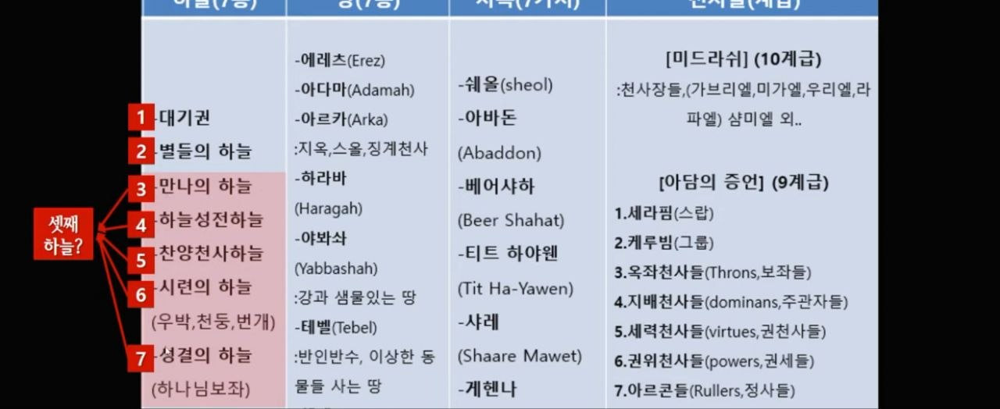

원문 도표는 하늘을 여러 층위로 나누어 보여 주고, 스올, 아바돈, 베에사하, 티트 하야웬, 사레, 게헨나와 같은 표현을 함께 배치합니다. 또한 미드라쉬, 아담의 증언 등의 분류 안에서 천사 계급을 제시합니다.

#### 천사들의 계급 자료

원문에는 천사들의 계급과 관련된 여러 도표가 이어집니다. 도표에는 스랍, 그룹, 보좌, 주관자, 권세, 능력, 정사, 천사장, 천사 등의 항목이 등장합니다.

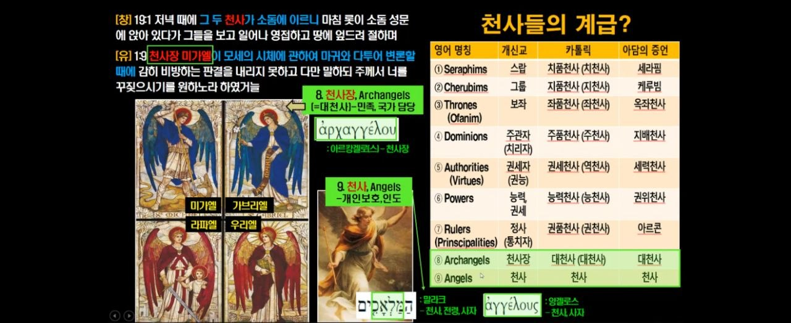

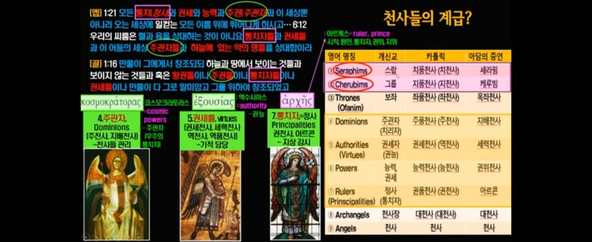

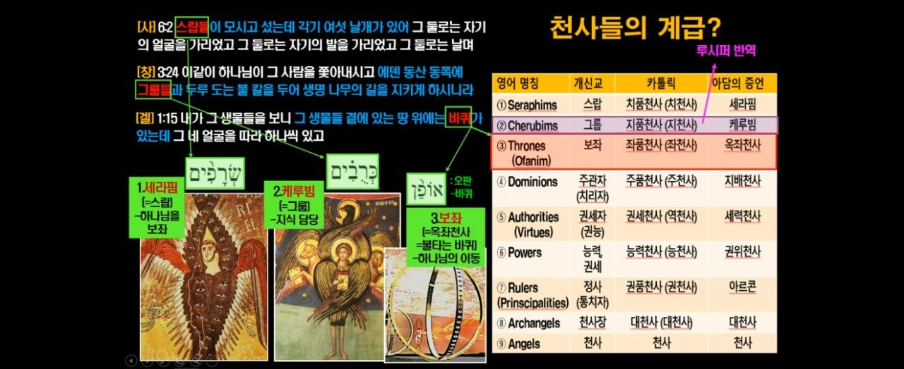

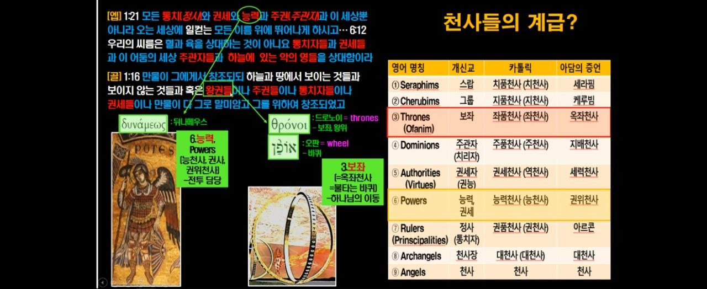

원문은 이 도표들을 통해 성경에 등장하는 보이지 않는 질서를 정리하려고 합니다. 특히 에베소서 3장 10절의 “하늘에 있는 통치자들과 권세”라는 표현과 연결하여, 교회가 하나님의 지혜를 드러내는 장면을 생각하게 합니다.

#### 시내산 자료

원문에는 아라비아에 있는 시내산에 관한 자료도 포함되어 있습니다.

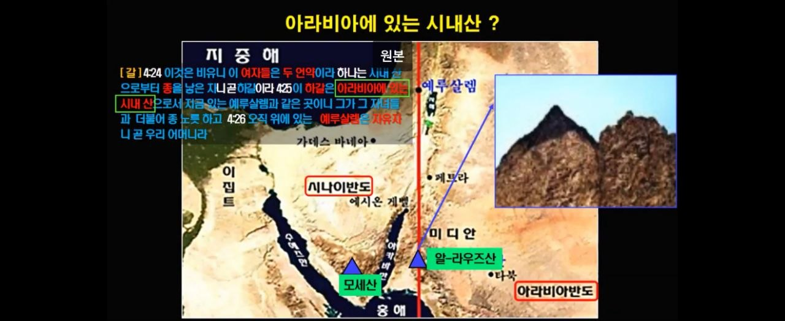

이 이미지는 갈라디아서 4장 24~26절의 흐름과 연결되어, 시내산과 예루살렘에 관한 비교를 시각적으로 제시합니다. 원문 안에서는 “다른 복음과 영지주의” 항목 앞에 배치되어, 이후 믿음과 복음의 분별로 이어지는 자료 역할을 합니다.

### 실전 예시 및 적용

성경 공부 모임에서 에베소서 3장 10절을 읽을 때, “하늘에 있는 통치자들과 권세”라는 표현은 추상적으로 느껴질 수 있습니다. 이때 원문 도표를 함께 보면 학습자는 성경이 보이는 세계만이 아니라 보이지 않는 질서까지 말하고 있음을 시각적으로 확인할 수 있습니다.

다만 적용의 핵심은 도표 자체를 외우는 데 있지 않습니다. 원문 흐름에서 더 중요한 점은 **교회로 말미암아 하나님의 지혜가 드러난다**는 사실입니다.

### 핵심 요약

원문은 천지 창조를 하늘, 땅, 지옥, 천사의 계급이라는 넓은 범위로 제시합니다. 여러 도표는 하늘의 층위와 천사 계급을 시각적으로 설명합니다. 이 내용은 에베소서 3장의 “하늘에 있는 통치자들과 권세”라는 표현과 연결됩니다. 핵심은 교회를 통해 하나님의 지혜가 드러난다는 점입니다.

### 확인 문제

1. 원문에서 “천지 창조” 항목에 함께 제시된 네 가지 범위는 무엇입니까?

   **정답:** 하늘, 땅, 지옥, 천사의 계급입니다.  
   **해설:** 원문은 “천지 창조 (하늘, 땅, 지옥, 천사의 계급)”이라고 항목을 제시합니다.

2. 에베소서 3장 10절에서 교회를 통해 알려지는 것은 무엇입니까?

   **정답:** 하나님의 각종 지혜입니다.  
   **해설:** 원문은 교회로 말미암아 하늘에 있는 통치자들과 권세들에게 하나님의 지혜가 알려진다고 제시합니다.

---

## 5단원. 다른 복음, 영지주의, 그리고 믿음의 반응

### 학습 목표

- 원문이 “다른 복음과 영지주의” 항목에서 어떤 분별의 필요를 제기하는지 이해할 수 있다.
- 누가복음 12장 24절과 마태복음 21장 28~31절을 통해 믿음의 반응을 설명할 수 있다.
- “말한 것”과 “행한 것”의 차이를 제자도의 관점에서 점검할 수 있다.

### 도입

복음은 믿음으로 받는 하나님의 은혜입니다. 그러나 원문은 동시에 “다른 복음과 영지주의”라는 항목을 제시하며, 무엇을 믿는지와 어떻게 반응하는지를 살피게 합니다. 이 단원은 믿음의 고백이 실제 순종의 방향으로 이어져야 함을 점검합니다.

### 핵심 본문

#### 다른 복음과 영지주의

원문은 별도의 항목으로 **다른 복음과 영지주의**를 제시합니다. 이 항목은 이후 누가복음 12장 24절, 마태복음 21장 28~31절, 그리고 여러 도표 자료와 연결되어 있습니다.

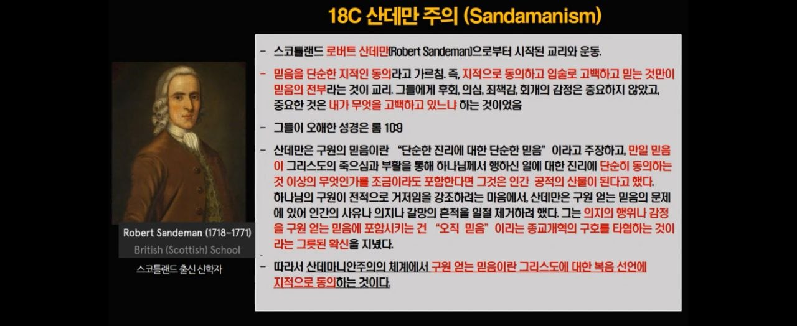

위 이미지는 원문에 포함된 산데마니안주의 자료입니다. 자료 안에서는 믿음을 지적인 동의로 축소하는 흐름을 다루며, “구원 얻는 믿음”이 무엇인지 질문하게 합니다. 이 내용은 원문 전체 주제인 “믿음구원, 행위심판”과 연결되어, 믿음이 단순한 말이나 지식으로만 머물 수 없음을 생각하게 합니다.

#### 하나님이 기르시는 믿음

누가복음 12장 24절은 까마귀를 예로 듭니다.

> “까마귀를 생각하라 심지도 아니하고 거두지도 아니하며 골방도 없고 창고도 없으되 하나님이 기르시나니 너희는 새보다 얼마나 더 귀하냐”

이 말씀은 하나님이 돌보시는 분이심을 보여 줍니다. 제자의 믿음은 자신이 모든 것을 통제해야 한다는 불안에서 벗어나, 하나님이 기르시고 돌보신다는 신뢰로 나아갑니다.

#### 두 아들의 비유와 실제 순종

마태복음 21장 28~31절은 두 아들의 비유를 말합니다.

첫째 아들은 “가겠나이다”라고 말했지만 가지 않았습니다. 둘째 아들은 처음에는 “싫소이다”라고 했지만 나중에 뉘우치고 갔습니다. 예수님은 “그 둘 중의 누가 아버지의 뜻대로 하였느냐”고 물으셨고, 대답은 둘째 아들이었습니다.

이 비유는 말의 고백과 실제 순종 사이의 차이를 보여 줍니다. 원문 주제와 연결하면, 믿음은 말로만 주장되는 것이 아니라 하나님 뜻을 향한 실제 반응으로 드러나야 합니다.

#### 신약의 흐름을 보는 도표

원문은 신약성경의 시대순 흐름과 역사적 상관관계를 보여 주는 자료도 함께 제시합니다.

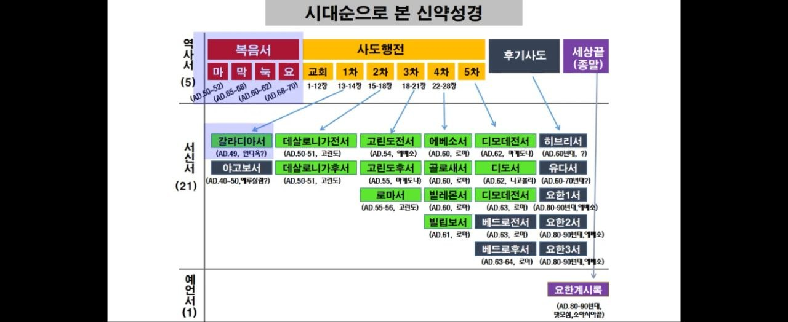

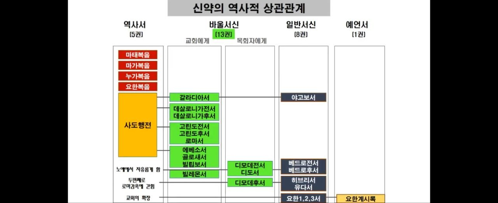

이 도표들은 복음서, 사도행전, 바울서신, 일반서신, 요한계시록의 흐름을 시각적으로 정리합니다. “다른 복음”을 분별하기 위해서는 단편적인 구절만 보는 것이 아니라, 성경의 흐름 속에서 복음과 믿음의 반응을 함께 보아야 합니다.

### 실전 예시 및 적용

어떤 사람이 “저는 믿습니다”라고 말하지만, 실제 삶에서는 주님의 말씀에 반응하지 않는다고 생각해 봅시다. 마태복음 21장의 두 아들 비유는 그 사람에게 중요한 질문을 던집니다.

> 나는 말로만 “가겠습니다”라고 하는 사람인가, 아니면 늦더라도 뉘우치고 아버지의 뜻을 행하는 사람인가?

제자의 적용은 자기 고백을 점검하는 것입니다. 믿음은 자기 확신의 말에 머물지 않고, 하나님이 돌보신다는 신뢰와 아버지의 뜻을 향한 순종으로 이어져야 합니다.

### 핵심 요약

원문은 다른 복음과 영지주의 항목을 통해 믿음의 내용을 분별하게 합니다. 누가복음 12장은 하나님이 기르시는 돌봄을 보여 주고, 마태복음 21장은 말보다 실제 순종이 중요함을 보여 줍니다. 제자는 믿음을 지식이나 말에만 머물게 하지 않고, 하나님 뜻을 향한 실제 반응으로 나타내야 합니다.

### 확인 문제

1. 마태복음 21장 28~31절에서 아버지의 뜻대로 행한 아들은 누구입니까?

   **정답:** 처음에는 싫다고 했지만 나중에 뉘우치고 간 둘째 아들입니다.  
   **해설:** 원문은 이 비유를 통해 말의 대답보다 실제 순종이 중요함을 보여 줍니다.

2. 누가복음 12장 24절에서 까마귀의 예는 무엇을 강조합니까?

   **정답:** 하나님이 기르시고 돌보시는 분이심을 강조합니다.  
   **해설:** 까마귀도 하나님이 기르시므로, 사람은 새보다 더 귀하다는 말씀을 통해 하나님의 돌봄을 신뢰하게 합니다.

---

## 6단원. 바울서신의 주제와 끝까지 지키는 믿음

### 학습 목표

- 원문이 정리한 바울의 13권 서신서 주제를 말할 수 있다.
- 바울의 전도여행 자료를 통해 서신서와 사도행전의 흐름을 연결할 수 있다.
- 디모데후서 4장 5~8절을 통해 끝까지 믿음을 지키는 제자의 태도를 설명할 수 있다.

### 도입

제자의 길은 시작만 중요한 것이 아닙니다. 원문은 바울의 전도여행과 13권 서신서의 주제를 정리한 뒤, 디모데후서의 마지막 고백으로 나아갑니다. 믿음으로 시작한 제자는 고난 속에서도 직무를 다하고, 달려갈 길을 마치며, 믿음을 지키는 사람으로 부름받습니다.

### 핵심 본문

#### 바울의 전도여행의 목적

원문은 “바울의 1~3차 전도여행의 목적”을 제시하며, 감옥에서의 지진을 “영적 예표”, “사단을 떨어뜨림”, “신부 단장”, “영화로운 교회”와 연결합니다. 표현은 압축적이지만, 전체 흐름은 바울의 사역이 복음 전파와 교회의 세움, 그리고 영화로운 교회라는 주제로 이어진다는 점을 보여 줍니다.

아래 이미지는 원문에 포함된 바울의 전도여정 자료입니다.

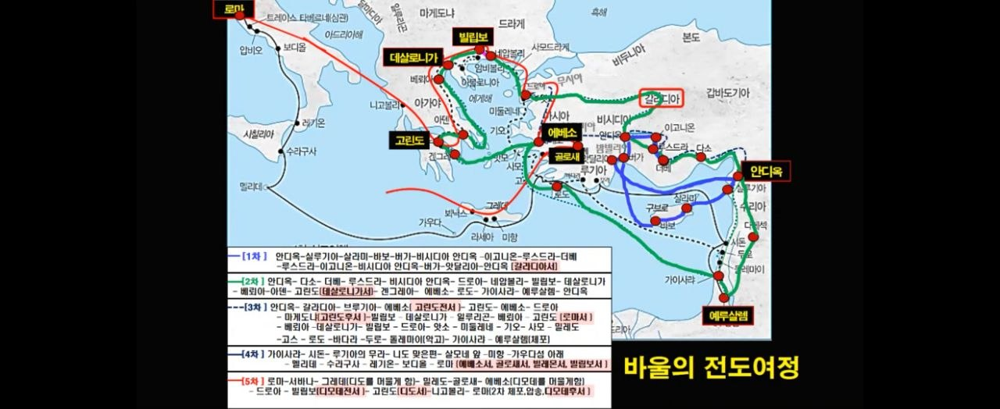

또 다른 자료는 바울의 생애와 전도여행, 서신서의 시기를 정리합니다.

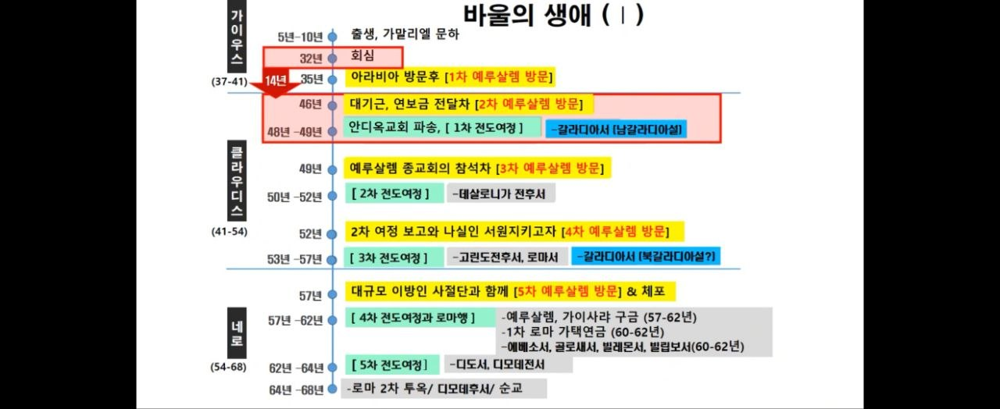

사도행전의 구조 자료는 바울의 전도여행이 예루살렘, 유럽, 로마로 확장되는 흐름 안에서 이해되도록 돕습니다.

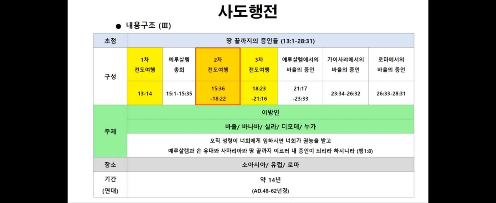

#### 13권의 서신서 주제

원문은 바울의 13권 서신서 주제를 세 묶음으로 정리합니다.

| 구분 | 서신서 | 주제 |
| --- | --- | --- |
| 1 | 갈라디아서, 데살로니가전서, 데살로니가후서, 고린도전서, 고린도후서, 로마서 | 믿음 |
| 2 | 에베소서, 골로새서, 빌립보서, 빌레몬서 | 교회 |
| 3 | 디모데전서, 디도서, 디모데후서 | 마지막 유언 |

이 정리는 원문 전체의 흐름과 잘 맞습니다. 앞 단원에서 믿음구원과 교회의 영화로움을 살폈다면, 마지막에는 바울의 유언적 권면을 통해 제자의 완주를 생각하게 됩니다.

#### 선한 싸움과 의의 면류관

디모데후서 4장 5~8절은 바울의 마지막 권면과 고백을 담고 있습니다.

> “너는 모든 일에 신중하여 고난을 받으며 전도자의 일을 하며 네 직무를 다하라”

> “나는 선한 싸움을 싸우고 나의 달려갈 길을 마치고 믿음을 지켰으니”

> “이제 후로는 나를 위하여 의의 면류관이 예비되었으므로...”

원문은 이 흐름을 **“고난 = 의의 면류관”**으로 정리합니다. 제자의 길에는 고난이 있지만, 그 고난은 직무를 다하고 믿음을 지키는 삶과 연결됩니다.

#### 영광에서 영광으로

원문은 빌립보서 2장 9~11절과 고린도후서 3장 18절~4장 6절을 다시 연결합니다.

고린도후서 3장 18절은 이렇게 말합니다.

> “우리가 다 수건을 벗은 얼굴로 거울을 보는 것 같이 주의 영광을 보매 그와 같은 형상으로 변화하여 영광에서 영광에 이르니”

제자의 완주는 단지 버티는 것이 아닙니다. 주의 영광을 바라보며 변화되고, 하나님께서 예수 그리스도의 얼굴에 있는 하나님의 영광을 아는 빛을 마음에 비추시는 삶입니다.

마지막으로 원문은 요한복음 17장 8절과 “우레소리를 듣는 자”라는 표현으로 마무리합니다.

> “나는 아버지께서 내게 주신 말씀들을 그들에게 주었사오며 그들은 이것을 받고... 믿었사옵나이다”

제자는 말씀을 받고 믿는 사람이며, 그 믿음 안에서 끝까지 달려갈 길을 마치는 사람입니다.

### 실전 예시 및 적용

훈련 과정이 끝날 때 학습자는 “무엇을 배웠는가?”뿐 아니라 “앞으로 어떻게 믿음을 지킬 것인가?”를 물어야 합니다. 바울의 고백은 제자의 자기 점검표가 됩니다.

- 나는 모든 일에 신중하려고 하는가?
- 고난을 피하기보다 전도자의 일을 감당하려 하는가?
- 내게 맡겨진 직무를 다하고 있는가?
- 믿음으로 시작한 길을 끝까지 지키려 하는가?

### 핵심 요약

원문은 바울의 13권 서신서를 믿음, 교회, 마지막 유언이라는 세 주제로 정리합니다. 바울의 전도여행 자료는 복음 전파와 교회의 세움이라는 흐름을 보여 줍니다. 디모데후서 4장은 고난 속에서도 직무를 다하고 믿음을 지키는 제자의 완주를 말합니다. 제자는 말씀을 받고 믿으며, 영광에서 영광으로 변화되는 길을 걷습니다.

### 확인 문제

1. 원문은 바울의 13권 서신서 주제를 어떤 세 묶음으로 정리합니까?

   **정답:** 믿음, 교회, 마지막 유언입니다.  
   **해설:** 원문은 갈라디아서부터 로마서까지를 믿음, 에베소서부터 빌레몬서까지를 교회, 디모데전서·디도서·디모데후서를 마지막 유언으로 정리합니다.

2. 디모데후서 4장 7절에서 바울은 자신의 삶을 어떻게 고백합니까?

   **정답:** “선한 싸움을 싸우고, 달려갈 길을 마치고, 믿음을 지켰다”고 고백합니다.  
   **해설:** 원문은 이 고백을 “고난 = 의의 면류관”이라는 정리와 연결하여 제자의 완주를 강조합니다.

---

## 전체 마무리

3기 제자 스쿨의 핵심 흐름은 **믿음으로 의롭게 됨**, **영화로운 교회**, **감추인 비밀과 은총**, **복음의 분별**, **끝까지 믿음을 지키는 제자의 길**로 정리할 수 있습니다. 원문은 여러 성경 본문과 도표를 통해 믿음이 단순한 지식이나 말에 머물지 않고, 교회를 세우고 맡겨진 직무를 감당하며 마지막까지 믿음을 지키는 삶으로 이어져야 함을 보여 줍니다.
