3기 제자 스쿨                               2026 상반기 2026-06-04~06

*주제 [믿음구원, 행위심판]

*갈라디아서 2:16 - 16

16. 사람이 의롭게 되는 것은 율법의 행위로 말미암음이 아니요 오직 예수 그리스도를 믿음으로 말미암는 줄 알므로 우리도 그리스도 예수를 믿나니 이는 우리가 율법의 행위로써가 아니고 그리스도를 믿음으로써 의롭다 함을 얻으려 함이라 율법의 행위로써는 의롭다 함을 얻을 육체가 없느니라

*로마서 1:17 - 17

17. 복음에는 하나님의 의가 나타나서 믿음으로 믿음에 이르게 하나니 기록된 바 오직 의인은 믿음으로 말미암아 살리라 함과 같으니라(합2;4, 오직?)

*바울의 1~3차 전도여행의 목적

(감옥에서 지진=영적 예표=사단을 떨어뜨림=신부 단장=표=영화로운 교회)

*영화로운 신부(엡5장27절)=7층천의 우레소리(계10장4절)=감추인 것(마13장35절)=영광의 소망(골1장27절)=자기를 비어, 모든 이름 위에 뛰어난 이름(빌2장7절~13절)=영화롭게(요12장28절,요17장5절)=보전하게(살전5장23절)=영광에서 영광으로(고후 3장18절,4장1절,5장1~3절)=듣고 믿음(갈3장2절)

*골로새서 1:24 - 27

24.  나는 이제 너희를 위하여 받는 괴로움을 기뻐하고 그리스도의 남은 고난을 그의 몸된 교회를 위하여 내 육체에 채우노라

26. 이 비밀은 만세와 만대로부터 감추어졌던 것인데 이제는 그의 성도들에게 나타났고

27. 하나님이 그들로 하여금 이 비밀의 영광이 이방인 가운데 얼마나 풍성한지를 알게 하려 하심이라 이 비밀은 너희 안에 계신 그리스도시니 곧 영광의 소망이니라

영화로운 신부=비밀의 영광=우레소리(요한복음에 숨겨놓음)=교회

*에베소서 5:27 - 28

27. 자기 앞에 영광스러운 교회로 세우사 티나 주름 잡힌 것이나 이런 것들이 없이 거룩하고 흠이 없게 하려 하심이라

28. 이와 같이 남편들도 자기 아내 사랑하기를 자기 자신과 같이 할지니 자기 아내를 사랑하는 자는 자기를 사랑하는 것이라

어떻게? 영화로운 교회를 이룰 수 있을까?

*에베소서 3:8 - 11

8. 모든 성도 중에 지극히 작은 자보다 더 작은 나에게 이 은혜를 주신 것은 측량할 수 없는 그리스도의 풍성함을 이방인에게 전하게 하시고

9. 영원부터 만물을 창조하신 하나님 속에 감추어졌던 비밀의 경륜이 어떠한 것을 드러내게 하려 하심이라

10. 이는 이제 교회로 말미암아 하늘에 있는 통치자들과 권세(사단의 회)들에게 하나님의 각종 지혜를 알게 하려 하심이니

11. 곧 영원부터 우리 주 그리스도 예수 안에서 예정하신 뜻대로 하신 것이라

*영화로운 교회를 통해 이방인에서 부터

*에베소서 3:14 - 15

14.  이러므로 내가 하늘과 땅에 있는 각 족속에게

15. 이름을 주신 아버지 앞에 무릎을 꿇고 비노니

*빌립보서 2:6 - 11

6. 그는 근본 하나님의 본체시나 하나님과 동등됨을 취할 것으로 여기지 아니하시고

7. 오히려 자기를 비워 종의 형체를 가지사 사람들과 같이 되셨고

8. 사람의 모양으로 나타나사 자기를 낮추시고 죽기까지 복종하셨으니 곧 십자가에 죽으심이라

9. 이러므로 하나님이 그를 지극히 높여 모든 이름 위에 뛰어난 이름을 주사

10. 하늘에 있는 자들과 땅에 있는 자들과 땅 아래에 있는 자들로 모든 무릎을 예수의 이름에 꿇게 하시고

11. 모든 입으로 예수 그리스도를 주라 시인하여 하나님 아버지께 영광을 돌리게 하셨느니라

요한복음=12;28=요17장 그리고 성령(요14;2,12,26절)

마태복음 13:34 - 35

34.  예수께서 이 모든 것을 무리에게 비유로 말씀하시고 비유가 아니면 아무 것도 말씀하지 아니하셨으니

35. 이는 선지자를 통하여 말씀하신 바 내가 입을 열어 비유로 말하고 창세부터 감추인 것들을 드러내리라 함을 이루려 하심이라

*감추인 것

이 모든 것은 사랑으로 파카드(방문하시고 돌보시는)하신 주님 때문에=은총

요한복음 21:17 - 17

17. 세 번째 이르시되 요한의 아들 시몬아 네가 나를 사랑하느냐 하시니 주께서 세 번째 네가 나를 사랑하느냐 하시므로 베드로가 근심하여 이르되 주님 모든 것을 아시오매 내가 주님을 사랑하는 줄을 주님께서 아시나이다 예수께서 이르시되 내 양을 먹이라

*천지 창조 (하늘, 땅, 지옥, 천사의 계급)

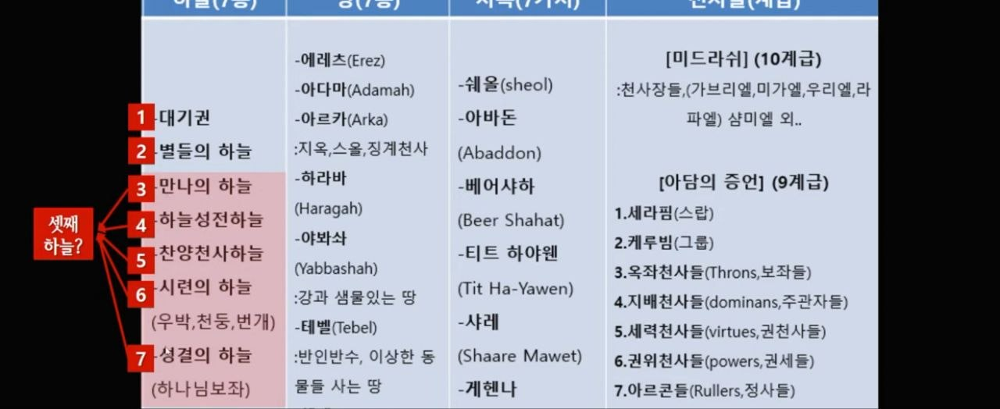

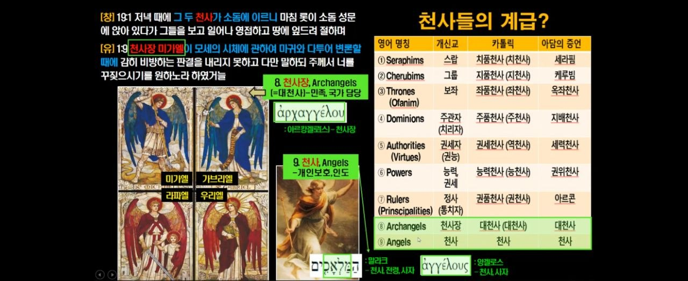

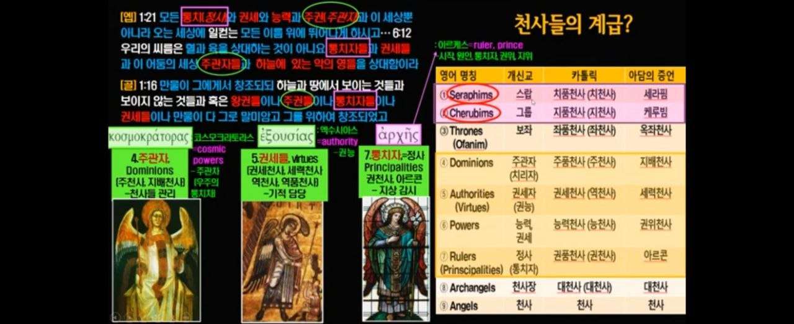

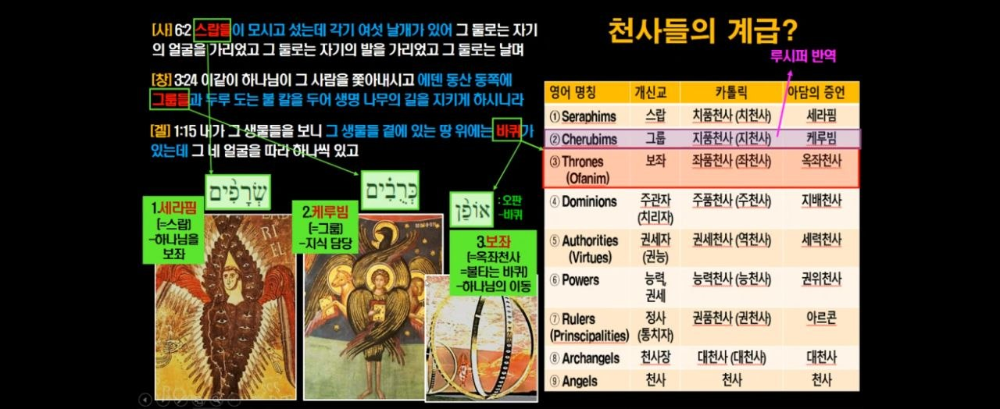

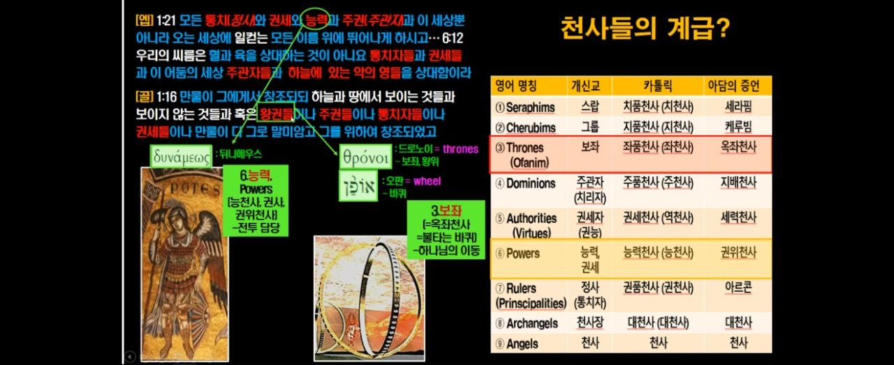

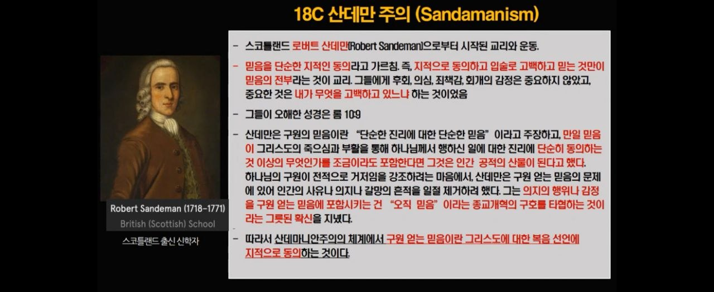

*다른 복음과 영지주의

*누가복음 12:24 - 24

24. 까마귀를 생각하라 심지도 아니하고 거두지도 아니하며 골방도 없고 창고도 없으되 하나님이 기르시나니 너희는 새보다 얼마나 더 귀하냐

*마태복음 21:28 - 31

28. 그러나 너희 생각에는 어떠하냐 어떤 사람에게 두 아들이 있는데 맏아들에게 가서 이르되 얘 오늘 포도원에 가서 일하라 하니

29. 대답하여 이르되 아버지 가겠나이다 하더니 가지 아니하고

30. 둘째 아들에게 가서 또 그와 같이 말하니 대답하여 이르되 싫소이다 하였다가 그 후에 뉘우치고 갔으니

31. 그 둘 중의 누가 아버지의 뜻대로 하였느냐 이르되 둘째 아들이니이다 예수께서 그들에게 이르시되 내가 진실로 너희에게 이르노니 세리들과 창녀들이 너희보다 먼저 하나님의 나라에 들어가리라

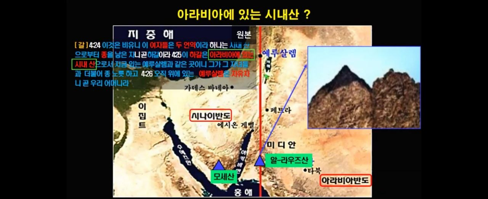

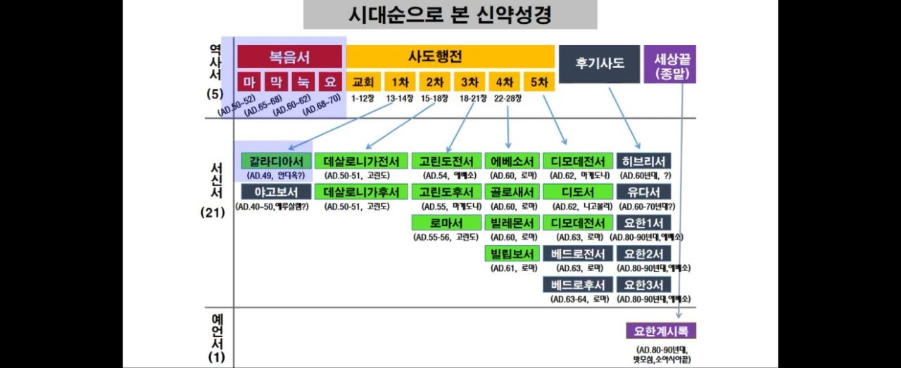

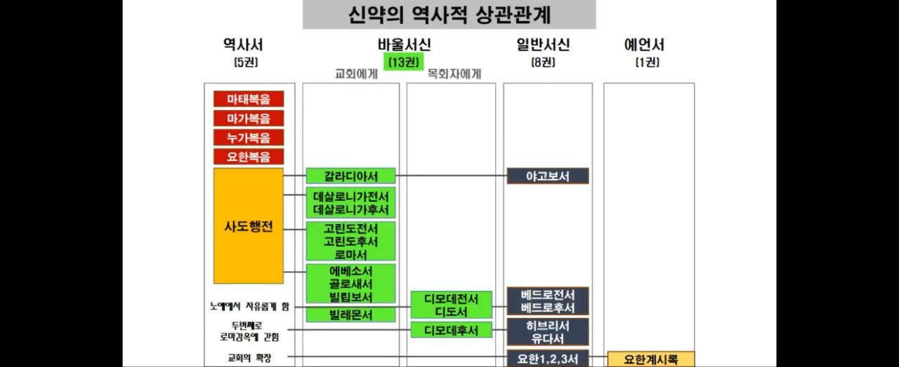

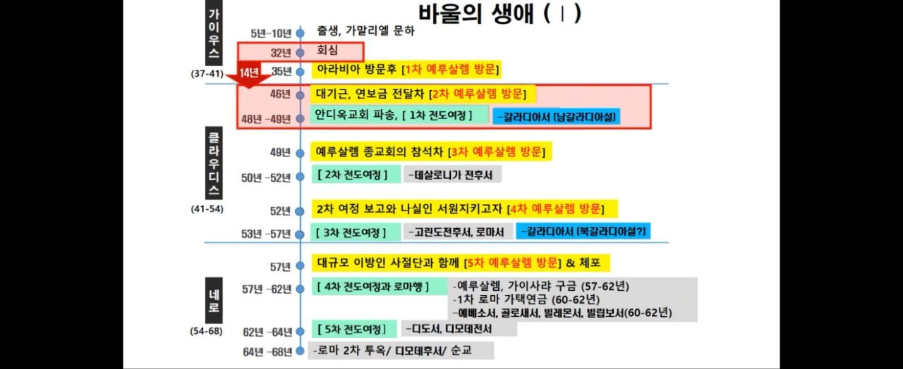

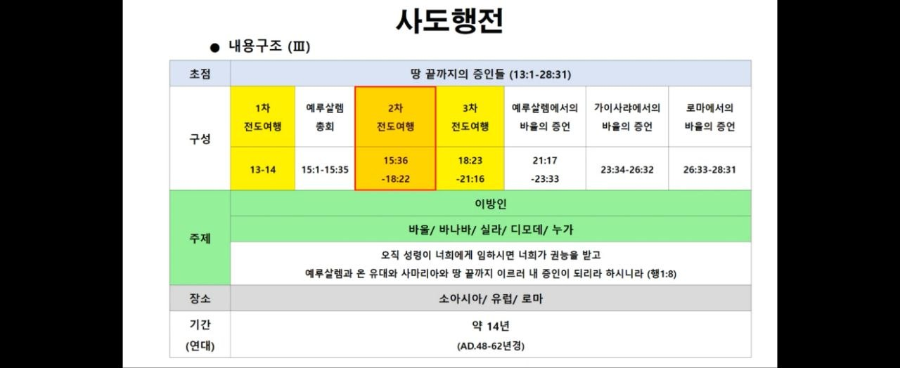

*13권의 서신서의 주제

1.믿음(갈,살전,후,고전,후,로마)

2.교회(엡골빌빌)

3.마지막 유언(딤전,딛,딤후)

*디모데후서 4:5 - 8

5. 그러나 너는 모든 일에 신중하여 고난을 받으며 전도자의 일을 하며 네 직무를 다하라

6. 전제와 같이 내가 벌써 부어지고 나의 떠날 시각이 가까웠도다

7. 나는 선한 싸움을 싸우고 나의 달려갈 길을 마치고 믿음을 지켰으니

8. 이제 후로는 나를 위하여 의의 면류관이 예비되었으므로 주 곧 의로우신 재판장이 그 날에 내게 주실 것이며 내게만 아니라 주의 나타나심을 사모하는 모든 자에게도니라

*고난=의의 면류관

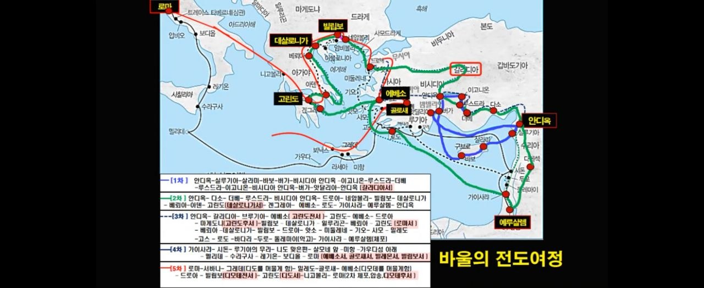

빌립보서 2:9 - 11

9. 이러므로 하나님이 그를 지극히 높여 모든 이름 위에 뛰어난 이름을 주사

10. 하늘에 있는 자들과 땅에 있는 자들과 땅 아래에 있는 자들로 모든 무릎을 예수의 이름에 꿇게 하시고

11. 모든 입으로 예수 그리스도를 주라 시인하여 하나님 아버지께 영광(영화로움)을 돌리게 하셨느니라

고린도후서 3:18 -4:6

3:18. 우리가 다 수건을 벗은 얼굴로 거울을 보는 것 같이 주의 영광을 보매 그와 같은 형상으로 변화하여 영광에서 영광에 이르니 곧 주의 영으로 말미암음이니라

4:6. 어두운 데에 빛이 비치라 말씀하셨던 그 하나님께서 예수 그리스도의 얼굴에 있는 하나님의 영광을 아는 빛을 우리 마음에 비추셨느니라

*요한복음 17:8 - 8

8. 나는 아버지께서 내게 주신 말씀들을 그들에게 주었사오며 그들은 이것을 받고 내가 아버지께로부터 나온 줄을 참으로 아오며 아버지께서 나를 보내신 줄도 믿었사옵나이다

*우레소리를 듣는 자
