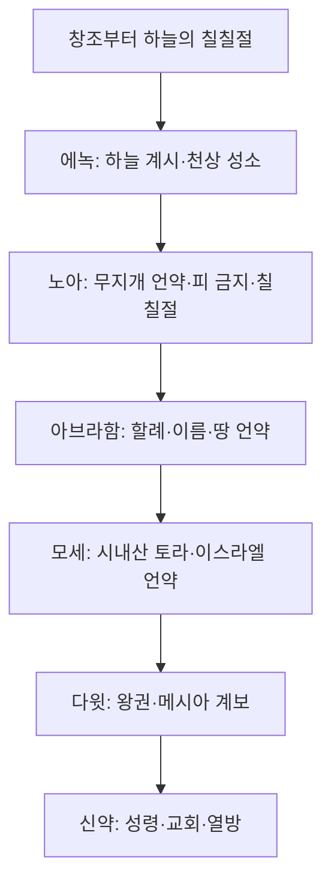

# 오순절(샤부옷) 정리

> **관련 자료:** [[오순절]] · [[03_케투빔/룻기연구강해/00-룻기-개요]] · [[03_케투빔/룻기연구강해/05-정리-핵심포인트와-묵상]] · [[절기/봄절기/오순절에읽는룻기-책/00-목차|오순절에 읽는 룻기(책)]]

---

## 이 문서에서 다루는 내용

| 순서 | 주제 |
|------|------|
| 1 | 오순절의 기본 정의와 성경적 근거 |
| 2 | 시내산(토라)과 시온산(성령) |
| 3 | 케투바(결혼 언약)와 오순절 |
| 4 | **희년서**가 말하는 오순절 |
| 5 | **에녹 → 메타트론**과 하늘의 오순절 |
| 5-1 | 에녹 문헌 3층 (1·2·3 에녹) |
| 5-2 | **3에녹(천궐서)** 변환 서사 |
| 5-3 | 오순절과 연결되는 전통 |
| 6 | 언약의 계보: 에녹 → 노아 → 아브라함 → 모세 → 다윗 |
| 7 | **룻기**와 오순절 |
| 8 | 절기 읽기 구조와 묵상 |

---

## 1. 오순절이란

### 이름과 뜻

- **히브리어:** 샤부옷(שָׁבוּעוֹת) — “주(週)들”, “일곱 주”
- **한국어:** 오순절 — 유월절 다음 날(초실절)부터 **50일째** 되는 날
- **영어:** Pentecost — “50일째”(πεντηκοστή)

### 성경에서의 위치

**구약** — 수확 절기이자 언약의 날로 기억됩니다.

> 레 23:15-16 … 유월절 다음 날 곧 칠칠을 계산하여 … 너희는 새 소산을 여호와께 드리라 …
>
> 신 16:10 … 네 하나님 여호와께서 네게 복을 주시리니 … 네 손으로 하는 모든 일에 …

**신약** — 성령 강림의 날입니다.

> 행 2:1-4 오순절날이 이미 이르매 … 저희가 다 성령의 충만함을 받고 …

### 49일: 오멜 카운트

유월절 이후 **초실절**부터 오순절 전날까지, 매일 보리 한 **오멜**을 드리며 7주(49일)를 셉니다. 이 기간을 **세피랏 하오메르**(오멜 세기)라고 합니다.

| 시기 | 절기 | 상징 |
|------|------|------|
| 유월절 | 구원의 시작 | 어린양의 피 |
| 무교절 | 정결의 길 | 누룩 없는 삶 |
| 초실절 | 부활의 첫 열매 | 보리의 첫 열매 |
| 49일 | 오멜 카운트 | 광야 → 시내산 |
| 50일째 | **오순절** | 토라 / 성령, 밀의 첫 열매 |

---

## 2. 두 산의 대조: 시내산과 시온산

구약 **시내산**의 오순절과 신약 **시온산(예루살렘)**의 오순절은 거울처럼 서로를 마주 보며, 하나님의 언약이 **돌판에서 마음판으로** 옮겨지는 사건으로 읽힙니다.

| 구분 | 모세의 오순절 (시내산) | 신약의 오순절 (시온산) |
|------|------------------------|------------------------|
| **장소** | 시내산 — 두려움과 율법의 산 | 예루살렘 — 친밀함과 은혜의 산 |
| **선물** | **토라**(율법) | **성령**(루아흐 하코데쉬) |
| **기록** | 차가운 **돌판** | 따뜻한 **육신의 마음판** |
| **불** | 산꼭대기에 임한 거대한 불 | 각 사람 **머리 위**에 임한 불 |
| **그 날의 결과** | 금송아지로 **3,000명 사망** | 베드로 설교로 **3,000명 구원** |

> 출 32:28 … 그 날에 백성이 삼천 명이나 죽었더라
>
> 행 2:41 … 그 날에 무리를 더하여 약 삼천 명이 받았더라

예레미야와 에스겔의 예언이 오순절에 성취됩니다.

> 31:33 … 내가 그들의 마음에 법을 두며 그들의 속에 기록하여 …
>
> 겔 36:26-27 … 새 영을 너희 속에 두고 … 내 영을 너희 속에 두어 …

**핵심:** 말씀만 있고 성령이 없으면 형식과 판단으로 굳어질 수 있고, 성령만 있고 말씀이 없으면 분별을 잃을 수 있습니다. 오순절은 **영과 진리**(신령과 진정)의 연합입니다.

> 요 4:23-24 … 신령과 진정으로 예배할 때가 오나니 …

---

## 3. 케투바(결혼 언약)와 오순절

유대 전통에서 시내산 강림은 **하나님(신랑)과 이스라엘(신부)의 결혼식**으로 이해됩니다.

| 이미지 | 의미 |
|--------|------|
| **후파(Chuppah)** | 시내산을 덮은 구름 — 우주적 결혼 덮개 |
| **케투바(Ketubah)** | 십계명 돌판 — 신랑이 신부에게 주는 결혼 서약서 |
| **돌판 파괴** | 금송아지 반역 후 모세가 돌판을 깸 — 깨어진 언약 |
| **성령** | 새 케투바를 **마음에 인치는** 보증금(아라본) |
| **옷자락으로 덮음** | 룻 3장, 겔 16장 — 언약·보호·결혼의 이미지 |

신약 오순절은 깨어진 언약이 그리스도의 피로 회복되고, 성령으로 서약이 마음에 새겨지는 **영적 결혼의 완성일**로 읽힙니다.

> 고후 3:3 … 그리스도의 편지라 … 마음의 판에 …

---

## 4. 희년서(Book of Jubilees)가 말하는 오순절

> **참고:** 2세기경 BCE 전후의 유대 외경(유외경). 사해사본에서도 발견. **정경은 아니지만**, 제2성전기 유대인들이 오순절을 어떻게 이해했는지 보여 주는 가장 중요한 자료 중 하나입니다.

### 4-1. 오순절 = “언약을 매년 갱신하는 날”

희년서는 오순절(칠칠절, 첫열매 절기)을 **모세가 처음 만든 절기**가 아니라, 창조부터 하늘에 있던 절기로 봅니다.

> Jubilees 6:17-18 … 하늘의 두루마리에 … 그들이 이 달에 **일 년에 한 번 칠칠절**을 지켜 **매년 언약을 갱신**하게 하였느니라 … 창조의 날부터 노아의 날까지 … 하늘에서 이 온 절기가 지켜졌고 …

### 4-2. 노아의 오순절 — 무지개 언약

대홍수 후, 노아가 방주에서 나온 **셋째 달 초하루**에 제단을 쌓고 제사를 드립니다. 피 먹기를 금하는 언약, 무지개의 표시, 칠칠절의 규례가 여기서 연결됩니다.

> Jubilees 6:1-4 … 셋째 달 초하루에 … 방주에서 나와 … 제단을 쌓고 …
>
> Jubilees 6:15-16 … 구름에 **무지개**를 두어 … 다시는 홍수로 멸하지 않겠다는 **영원한 언약**의 표징으로 …

**요지:** 노아의 오순절 = 피로 더러워진 땅이 정결된 뒤, 인류와 하나님 사이 **평화의 언약**이 시작된 날.

### 4-3. 아브라함의 오순절 — 할례와 언약

희년서 15장은 아브라함이 **셋째 달 15일**(중순)에 첫열매 절기를 지키는 가운데, 하나님이 나타나 **아브람→아브라함**으로 이름을 바꾸고 할례 언약을 세우는 장면을 묘사합니다. (창 17장과 연결)

**요지:** 오순절 = 노아 이후 잊혀 가던 절기를 족장들이 다시 지키며, **선택된 가문** 안에서 언약이 구체화되는 날.

### 4-4. 모세의 오순절 — 시내산에서의 회복

이스라엘이 애굽에서 이 절기를 잊었고, 모세가 시내산에서 율법을 받으며 **영원한 언약의 장엄한 회복**이 이루어졌다고 봅니다. 희년서 전체는 “천사가 모세에게 시내산에서 계시한 두 번째 율법”이라는 틀로 쓰여 있습니다.

### 4-5. 364일 달력과 날짜 차이

희년서는 **1년 364일**(52주 × 7일) 태양력 달력을 사용합니다. 그래서 칠칠절은 **항상 일요일**에 맞춰집니다.

| 항목 | 희년서 | 랍비 전통(대체로) |
|------|--------|------------------|
| 오순절 날짜 | **3월(시반) 15일** | 3월(시반) **6일** |
| 시내산과의 연결 | 최초로 명시적으로 연결한 자료 중 하나 | 토라 수여일로 확립 |
| 절기 기원 | 창조·노아·족장 → 모세 | 레 23, 출 19-20 |

> **읽을 때 주의:** 날짜·달력 차이는 당시 유대 공동체 안의 **해석 다양성**을 보여 줍니다. 오늘의 교회 달력과 1:1로 맞출 필요는 없고, “오순절 = 언약·수확·갱신”이라는 **신학적 흐름**을 읽는 데 도움이 됩니다.

---

## 5. 에녹 → 메타트론: 하늘의 오순절

> **먼저 알아둘 점:** 성경(창 5)은 에녹이 “하나님과 동행하다가 하나님께로 옮겨졌다”고만 말합니다. **“메타트론”이라는 이름과 “오순절에 변했다”는 말은 성경 본문에 없습니다.** 이 이야기는 2~6세기경 유대 **외경·미드라시·천궐문헌(헤칼로트)** 에서 점점 커진 전통입니다. [[오순절]]에서 다룬 내용을 여기서 체계적으로 정리합니다.

### 5-0. 문헌이 쌓인 순서

| 층위 | 문헌 | 시기(대략) | 메타트론? | 오순절 날짜 연결? |
|------|------|-----------|-----------|------------------|
| **정경** | 창 5:21-24 | — | 없음 | 없음 |
| **1에녹** | 천사서·광명자서 등 | 3~1세기 BCE | 없음 (이름 미등장) | 364일 달력·3월 절기 흐름 |
| **2에녹** | 슬라브 에녹서 | 1세기경 | 후대 전통이 연결 | **시반 1일 승천, 60일 체류** (가장 뚜렷) |
| **랍비·타르굼** | Targ. Ps.-Jonathan 등 | 1~5세기 | **메타트론** 명시 | 간접 |
| **3에녹** | 천궐서(Sefer Hekhalot) | 5~6세기 CE | **핵심 서사** | 간접 (계시·언약의 날) |

**요지:** “에녹이 오순절에 메타트론이 되었다”는 말은 **한 권의 성경 구절**이 아니라, 여러 문헌이 겹쳐 만든 **신학적·전통적 그림**입니다. 그럼에도 오순절을 이해하는 데 매우 중요한 축입니다.

---

### 5-1. 성경의 출발점: 창세기의 에녹

> 창 5:22-24 엔옥은 … 하나님과 동행하더니 … 삼백육십오세를 행하며 … 하나님께로 옮기웠으니 하나님이 그를 옮기심이라

| 특징 | 의미 |
|------|------|
| **365세** | 해의 날 수와 같다는 해석이 많음 (해 달력적 상징) |
| **죽음 없이 옮김** | 엘리야(왕하 2)와 함께 “살아서 하늘로” 간 인물 |
| **말씀 최소** | 어떻게·언제·어디로 옮겨졌는지는 말하지 않음 → 후대 전설의 여백 |

> 히 11:5 믿음으로 에녹은 … 죽음을 보지 않고 옮기웠으니 …

---

### 5-2. 1에녹: 하늘 계시의 원형 (아직 메타트론은 아님)

**1에녹**은 사해사본에서도 크게 발견되었습니다. **메타트론**이라는 이름은 나오지 않지만, “하늘의 오순절”을 상상하는 데 필요한 **보좌 계시·천상 성전·제사장적 입문**이 여기 있습니다.

#### (1) 보좌 환상 — 1에녹 14장

에녹이 하늘에 올라 **담 → 바깥집 → 안쪽집**을 지나 보좌에 이릅니다. 지상 성전(에스겔 40-48)을 본뜬 **천상 성소 입장**으로 널리 해석됩니다.

> 1 Enoch 14:18-22 … 높은 보좌 … 그 모양이 얼음 같고 … 크고 영화로운 보좌 …

| 비교 | 공통점 |
|------|--------|
| 이사야 6 | 보좌, 연화, 사역 부르심 |
| 에스겔 1 | 환상·보좌·이동하는 영광 |
| 다니엘 7 | 인자와 보좌 |
| **출 19-20** | 시내산에서 백성에게 내려오는 **토라 계시** |

**신학적 읽기:** 모세 이전에, 에녹은 이미 **하늘 성소에서 계시를 받는 인물**로 그려집니다. 지상의 오순절(시내산) **이전**에 있는 “하늘 차원의 계시 절기”라는 관점이 여기서 출발합니다.

#### (2) 364일 달력 — 1에녹 72-82장

천사 **우리엘**이 364일 해의 달력을 가르칩니다. 희년서와 같이 **3월(셋째 달)** 이 수확·언약의 달로 잡히는 달력 체계와 맞물립니다.

#### (3) 1에녹 71장 — “인자”와 에녹

1에녹 후반부(광명자서)에서는 에녹이 하늘에서 높은 지위를 받는 장면이 이어집니다. 후대 유대교·카발라에서 **메타트론 = 하늘의 대리자**로 연결하는 흐름의 씨앗이 됩니다.

---

### 5-3. 2에녹: 오순절 날짜와 가장 직접 맞닿는 승천 서사

**2에녹**(슬라브 에녹서)은 “에녹이 **시반월(Sivan) 첫날**에 하늘로 올라가 **60일** 머물렀다”는 전통의 주된 근거가 됩니다. (본문 전승·장절 번호는 사본마다 다소 다름.)

| 요소 | 전통적 해석 |
|------|-------------|
| **시반 1일** | 셋째 달 초하루 — 오순절(칠칠절)이 놓이는 **3월**과 겹침 |
| **60일** | 하늘에서 계시·교육·변화의 기간 (광야 50일+α와 비교되기도 함) |
| **가족의 3일 잔치** | 일부 전통: 에녹이 떠난 뒤 가족이 3일 연회 — 오순절 **2·3일** 연속 경축과 연결해 읽기도 함 |

**랍비 달력(시반 6일)** 과 **희년서(시반 15일)** 과는 날짜가 다릅니다. 공통점은 **셋째 달 = 계시·언약·첫열매·하늘과 땅이 만나는 달**입니다.

2에녹은 “에녹의 승천을 **오순절 달력 안**에 넣으려는” 가장 노골적인 외경입니다. [[오순절]]에서 말한 “에녹의 우주적 오순절”은 주로 이 흐름과 3에녹을 엮은 것입니다.

---

### 5-4. 3에녹(천궐서): 에녹이 메타트론이 되는 본격 서사

**3에녹**(Sefer Hekhalot)은 유대 **신비문헌(헤칼로트·메르카바)** 의 핵심입니다. 가명: **대제사장 이스마엘**이 하늘에 올라가 **메타트론**을 만나고, 그가 바로 **에녹**이었다는 것을 듣습니다. (최종 정리 5~6세기경으로 추정.)

#### 서사의 줄기 (요약)

| 단계 | 3에녹에서 말하는 일 (대략) | 상징 |
|------|---------------------------|------|
| 1 | 에녹이 하늘로 **올라감** (병거·폭풍 이미지) | 엘리야·메르카바 전통 |
| 2 | **육신이 빛의 몸**으로 변화 | 죽음 없는 영화로의 전환 |
| 3 | 이름이 **메타트론**으로 확장 (70 이름) | 새 정체성·새 사역 |
| 4 | **천사장·대리자** — Sar ha-Panim (앞의 왕자) | 시내산 “얼굴에서 말씀”과 연결 |
| 5 | **천상 서기관** — 창조의 비밀·달력·토라 기록 | 하늘에서 먼저 받은 “토라” |
| 6 | **모세**에게 계시를 전달한다는 전통 | 시내 오순절의 “중보자” |

#### 메타트론(מְטַטְרוֹן)이란 무엇인가

| 해석 | 내용 |
|------|------|
| 어원 (유력) | 그리스 **μετά + θρόνος** “보좌 옆/보좌를 따라” |
| 직분 | 하나님 보좌 가까이에서 **말씀·명령·기록**을 매개 |
| 다른 이름 | **이스라엘의 왕자**, **대제사장**, **하노크(에녹)** |
| 논쟁 | 일부 전통의 “작은 여호와” 표현 → 탈무드에서 **신격 혼동 경계** 논쟁 |

**탈무드 참고:**

- b. Sanhedrin 38b — 메타트론에게 이름을 묻는 장면 (메타트론이 신이 아님을 분명히 하려는 논쟁)
- b. Hagigah 15a — “셈(이름) = 메타트론 = 에녹”이라는 전승 인용

#### 랍비·타르굼 전통

**Targum Pseudo-Jonathan** (창 5:24): 에녹은 **메타트론**과 **대서기관(Safra Rabba)** 이라는 이름·직분을 받고 하늘로 옮겨졌다.

[Jewish Encyclopedia, “Enoch”](https://www.jewishencyclopedia.com/articles/5772-enoch) 요약:

- **천사장**, **하나님 앞의 왕자(Prince of the Presence)**
- **토라의 왕자**, **지혜의 왕자**, **대서기관**
- **모세에게 하나님의 계시를 전달**하는 중보자

---

### 5-5. “오순절에 메타트론이 되었다”는 말을 어떻게 이해할까

#### (1) 직접 연결 vs 간접 연결

| 종류 | 내용 |
|------|------|
| **직접 (2에녹)** | 시반월 1일 승천 + 60일 하늘 체류 |
| **간접 (3에녹)** | “계시·언약·토라가 하늘에서 먼저 열리는 날”의 **원형** |
| **간접 (1에녹 14)** | 보좌 계시 = 하늘 성소 입문 |
| **간접 (희년서)** | 3월 = 칠칠절·언약 갱신의 달 |

**학술적으로:** “에녹이 **랍비 오순절(시반 6일)** 에 메타트론이 되었다”고 **단정할 단일 고대 본문**은 없습니다. 다만 **셋째 달(시반) = 승천·계시·언약**이라는 전통 묶음은 매우 강합니다.

#### (2) “하늘의 오순절” vs “시내의 오순절”

| 하늘 (에녹·메타트론) | 땅 (모세·이스라엘) |
|---------------------|-------------------|
| 에녹이 하늘 성소에서 계시·제사장 직분 수령 | 이스라엘이 시내산에서 **토라** 수령 |
| 메타트론이 **천상 서기관** | 모세가 **율법을 기록** |
| 60일/보좌 환상 = **준비·변화** | 49일 오멜 + 50일째 = **오순절** |
| 하늘에서 먼저 열린 **언약의 문** | 땅에서 성취된 **언약의 백성** |

**한 문장:** 에녹-메타트론 전통은 “토라가 시내산에 내려오기 **전에**, 이미 하늘에서 계시와 언약이 열려 있었다”는 **하늘 차원의 오순절**을 말합니다.

#### (3) 신약 오순절과의 대응

| 에녹 → 메타트론 | 모세의 오순절 | 신약 오순절 |
|-----------------|---------------|-------------|
| 하늘로 **올라감** | 시내산에 **말씀** | 시온산에 **성령** |
| **빛의 몸**·천사로 변화 | 돌판에 **글자** | **마음판**에 기록 |
| **70 이름**·확장된 정체성 | 12지파·언약 백성 | **각 사람 머리 위** 불 |
| 천상 **서기관** | 모세 **중보자** | 성령 **보혜사·증언** |

#### (4) 다윗·룻기와의 연결

- **다윗**이 오순절에 태어나고 죽었다는 **랍비 전통**과 병치하면, 3월은 “**왕·계보·언약이 열리는 달**”이 됩니다.
- **룻기**는 그 계보(룻 → 오벳 → 다윗)의 **땅 위 이야기**입니다.
- **에녹-메타트론**은 그 계보 **이전**에, 하늘에서 이미 열린 **계시·서기·언약**의 이야기입니다.

---

### 5-6. 읽을 때 반드시 지킬 균형

1. **성경 우선:** 창 5:24는 메타트론을 말하지 않습니다.
2. **문헌 구분:** 1에녹 ≠ 2에녹 ≠ 3에녹 — 서로 다른 책입니다.
3. **날짜 단정 금지:** 시반 1일 / 6일 / 15일은 공동체·문헌마다 다릅니다.
4. **신격 경계:** 메타트론은 **천사·대리자·서기관**이지, 성령이나 그리스도를 대체하는 인물이 아닙니다.
5. **영적 적용:** “하나님이 계시를 주시는 절기”에, **이미 하늘에서 준비된 언약**이 시내산·시온산·우리 마음으로 **내려온다**는 **묵상의 틀**로 쓰는 것이 안전합니다.

### 5-7. 이 절기 묵상용 핵심 문장

> 에녹은 죽음을 보지 않고 하늘로 옮겨졌고, 유대 전통은 그를 **메타트론** — 보좌 앞의 서기관, 토라의 전달자 — 이라 불렀다. 시반(셋째 달)의 승천과 60일의 계시, 보좌 환상, 빛으로 변한 몸은 **“하늘에서 먼저 열린 오순절”** 의 그림이다. 그 후 모세의 시내산, 그리고 신약의 성령 오순절은, 그 하늘의 문이 **땅과 각 사람 안**으로 내려온 사건이다.

---

## 6. 언약의 계보: 한눈에 보기

고대 유대 문헌(특히 **희년서**, **오순절.md** 정리)은 오순절을 **매년 갱신되는 언약의 날**로 봅니다.

| 인물 | 오순절과의 연결 (전통·유외경) | 성경 본문 |
|------|------------------------------|-----------|
| **에녹** | 시반 1일 승천(2에녹)·60일 계시 → **메타트론**(3에녹·타르굼): 천상 서기관, 모세에게 토라 전달 | 창 5; 1 En 14; 2 En; 3 En |
| **노아** | 방주 후 제사, 무지개 언약, 칠칠절 | 창 8-9; Jubilees 6 |
| **아브라함** | 첫열매 절기, 할례 언약 | 창 15, 17; Jubilees 15 |
| **모세** | 시내산 토라 수여 | 출 19-20 |
| **다윗** | 오순절에 태어나고 죽었다는 **랍비 전통** | (전통; 성경 본문 아님) |
| **예수·교회** | 새 언약, 성령, 3,000명 구원 | 행 2; 고후 3 |

---

## 7. 룻기와 오순절 — 미시적 언약의 이야기

앞의 내용이 **거시적·국가적** 오순절(토라·성령·언약 갱신)이라면, **룻기**는 그 언약이 **한 가정·한 이방 여인** 안에서 어떻게 성취되는지 보여 줍니다.

> 상세: [[03_케투빔/룻기연구강해/00-룻기-개요]] · [[03_케투빔/룻기연구강해/05-정리-핵심포인트와-묵상]]

### 메길로트 — 오순절에 읽는 두루마리

| 두루마리 | 절기 | 그림 |
|----------|------|------|
| 아가서 | 유월절 | 신랑과 신부의 사랑 |
| **룻기** | **오순절** | 이방과 이스라엘의 연합, 회복 |
| 애가서 | 티샤 베아브 | 성전 파괴의 슬픔 |
| 전도서 | 장막절 | 헛됨을 지나는 승리 |
| 에스더서 | 부림절 | 백성과 대적의 싸움 |

유대 전통: 오순절 밤 회당에서 토라·시편을 읽고, **새벽에 룻기**를 읽는다. 성령이 임한 **오전 9시**쯤, 말씀이 가득한 가운데 읽히는 마지막 두루마리가 룻기다.

### 룻기를 오순절에 읽는 네 가지 이유

1. **추수의 완성** — 보리(초실절)에서 밀(오순절)까지 = 오멜 카운트 49일
2. **고엘의 완성** — 성문에서 기업 회복 = 말씀·성령으로 완성되는 구속
3. **이방의 연합** — 룻의 신앙 고백 = 열방이 하나님께 붙는 그림
4. **메시아의 계보** — 오벳 → 이새 → **다윗** → 예수 그리스도

### 거시(오순절)와 미시(룻기)의 연결

| 거시적 오순절 | 룻기에서의 실현 |
|---------------|-----------------|
| 토라 + 성령 | 보아스의 헤세드 + 룻의 다바크 |
| 케투바·후파 | “옷자락으로 덮으소서”(룻 3:9) |
| 언약 갱신 | 고엘이 끊어진 **이름·기업** 회복 |
| 다윗(전통) | 룻기 4:22 — 족보의 마지막 이름 |
| 3,000 구원 | 한 과부·이방 여인 → 왕의 계보 |

> **한 문장:** 오순절 대화가 “하나님이 거대한 언약(토라·성령)을 주셨다”는 **뼈대**라면, 룻기는 “그 언약이 보아스(고엘)와 룻(신부)을 통해 다윗의 계보로 완성되었다”는 **살과 피**다.

---

## 8. 절기 읽기 구조 (스터디용)

[[03_케투빔/룻기연구강해/00-룻기-개요]]에서 정리한 오순절 리딩 구조입니다.

| 구분 | 본문 | 초점 |
|------|------|------|
| **파라샤** | 민 28:26-31 | 오순절 제사 |
| **하프타라** | 겔 1:1-28, 3:12 | 하나님 보좌 환상 |
| **킹덤** | 행 2:1-21 | 성령 강림 |
| **복음** | 요 14:15-26 | 보혜사 약속 |
| **메길라** | 룻기 전체 | 연합·고엘·계보 |

### 룻기 4장과 절기 대응

| 장 | 절기 | 핵심 |
|----|------|------|
| 1장 | 유월절·초실절 | 상실, 룻의 다바크 |
| 2장 | 오멜 카운트 | 보아스, 헤세드 |
| 3장 | 추수 전날 밤 | 타작마당, 야라쉬 |
| 4장 | **오순절** | 성문, 고엘 완성, 다윗 |

---

## 9. 종합: 오순절을 어떻게 기억할까

### 신학적 핵심 (한 페이지 요약)

1. **수확** — 보리에서 밀로, 광야에서 시내산으로, 개인에서 공동체로
2. **언약** — 노아·아브라함·모세의 언약이 그리스도 안에서 **갱신**
3. **연합** — 말씀과 성령, 하늘과 땅, 이스라엘과 열방, 신랑과 신부
4. **구속** — 고엘이 이름과 기업을 회복 → 예수 그리스도, 우리의 고엘
5. **완성** — 3,000의 죽음이 3,000의 생명으로, 돌판이 마음판으로

### 묵상 질문

1. 나는 **시내산**(두려움·율법)과 **시온산**(은혜·성령) 중 어디에 머물러 있는가?
2. 하나님과 나의 관계를 **케투바**(언약)로 보고 있는가?
3. **룻**처럼 다바크(붙잡음)하고, **보아스**처럼 헤세드(헌신)할 수 있는가?
4. 우연처럼 보이는 오늘의 만남 뒤에 **미크레**(섭리)가 있는가?

---

## 10. 참고와 주의

### 자료 구분

| 종류 | 예 | 읽는 태도 |
|------|-----|-----------|
| **정경** | 출 19-20, 레 23, 행 2, 요 14 | 신앙의 기준 |
| **랍비 전통** | 시내 결혼식, 다윗 생몰일 | 유대 해석사 |
| **유외경** | 희년서, 1에녹 | 2세기 유대인의 오순절 이해 |
| **교회 스터디** | [[오순절]], [[룻기연구강해]] | 묵상·강해 정리 |

### 웹·학술 참고 (요지)

- [Shavuot: The Festival of Covenants (TheTorah.com)](https://www.thetorah.com/article/shavuot-the-festival-of-covenants) — 희년서와 시내산·언약
- [Jubilees 6 (CCEL)](https://www.ccel.org/c/charles/pseudepigrapha/jubilee/6.htm) — 노아, 칠칠절, 364일
- [Enoch calendar (Wikipedia)](https://en.wikipedia.org/wiki/Enoch_calendar) — 364일 달력 개요

---

> **마지막 한 줄**
>
> 오순절은 “성령 하루”가 아니라, **창조부터 이어진 언약이 하늘(에녹)과 땅(모세)과 가정(룻)과 왕(다윗)을 거쳐, 말씀과 성령 안에서 오늘 우리에게 갱신되는 날**이다.
